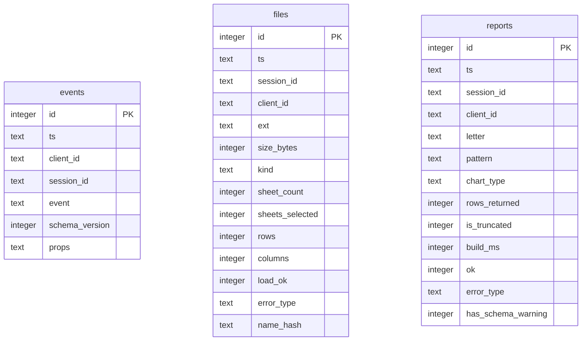

# Database schema — usage.db

`usage.db` is a stdlib-sqlite3 usage-tracking database, written by
[app/data/telemetry.py](../app/data/telemetry.py). It's the only database in the
app — normal analyze/report/export flows never read from or write to it; it exists
purely to answer "how many people used this, what did they upload, did it work"
after a restart. See [docs/USAGE_DB_BROWSING.md](USAGE_DB_BROWSING.md) for how to
browse it and useful SQL.

No cell values from a user's spreadsheet are ever stored here — filenames and
column names are hashed by default (`TELEMETRY_STORE_NAMES=1` stores plaintext,
dev-only).

## ER diagram

There are no foreign-key constraints between the three tables — `session_id` and
`client_id` are plain text columns used to correlate rows, not enforced
relationships. A session typically has one `events` row per lifecycle stage, one
`files` row per uploaded file, and up to three `reports` rows (one per A/B/C
recommendation actually built).

## Tables

**`events`** — one row per tracked action (`analysis_started`, `analysis_completed`,
`analysis_failed`, `report_exported`, etc.). `props` is a JSON blob of
event-specific detail; `schema_version` is bumped whenever a prop's meaning
changes, so old and new rows stay distinguishable.

**`files`** — one row per file in an upload batch: extension, size, workbook shape
(`sheet_count`/`sheets_selected`), row/column counts, and whether it loaded
successfully. `name_hash` is the filename's hash (or plaintext, if
`TELEMETRY_STORE_NAMES=1`).

**`reports`** — one row per report actually built: which recommendation letter,
its pattern (RANKING/DISTRIBUTION/etc.), chart type, row count, build time, and
whether it succeeded.

## Config

| Variable | Purpose |
|---|---|
| `TELEMETRY_DB` | Override the database file path (default: `usage.db` at repo root) |
| `TELEMETRY_STORE_NAMES` | Store plaintext filenames/columns instead of hashed (dev-only) |

Every write swallows its own exceptions — telemetry is never allowed to fail a
user request.
